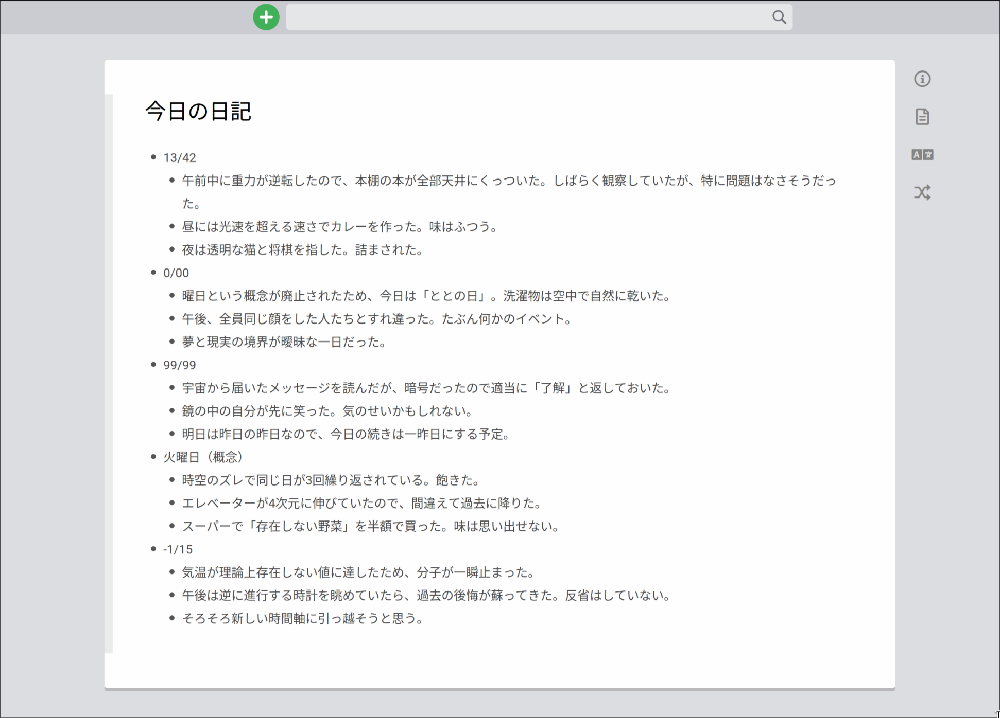

# 📘 Scrapbox Diary

Scrapbox Diary は、プライベートな Scrapbox プロジェクトに書かれた日記ページを整形し、ウェブサイトとして公開できるツールです。
Scrapbox のページは、自動で同期させることができます。


<details>

<summary>元の Scprapbox ページのスクリーンショット</summary>



</details>

## ⚙️ Architecture

このプロジェクトは、compose.yml で以下の2つのサービスを定義しています：

- builder：Scrapbox からページを取得し、データを注入して Astro で静的サイトをビルドします。
- web：ビルド済みサイトを配信する簡易ウェブサーバです。

## 🚀 Usage

builder が定期的に実行されるように cron を設定することで、任意の頻度でページを自動更新できます。

```
$ git clone https://github.com/n4mlz/scrapbox_diary.git
$ cd scrapbox_diary
$ docker compose up -d # builderとwebの起動
$ (crontab -l ; echo "0 * * * * cd /path/to/scrapbox_diary && docker compose up builder")| crontab - # 1時間おきにbuilderを実行
```

## 📜 License

このプロジェクトは MIT License のもとで公開されています。
